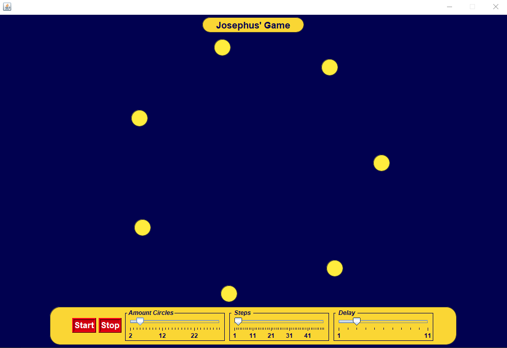

# Josephus-Simulator
 
This project was made by Luis Felipe and Mateus Assalti as a part of a university work. 

The objective of the app is to simulate [Josephus Problem](https://en.wikipedia.org/wiki/Josephus_problem). The program is straightfoward and intuitive. We have tree customizable options: 
- Amount circles: increase or decrease the number of people/circles
- Delay: increase or decrease the delay of which the algorithm will have
- Steps: increase or decrease the person to be eliminated from the simulation when it's running

And we have **Start** and **Stop** button

## Disclameir

It's known that the program has some issues and we have no pretension to adjust
